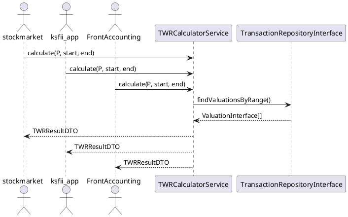

# UML — portfolio-math module

## TWR Calculation



## IRR Calculation

```plantuml
@startuml
actor stockmarket
TWRCalculatorService ..> TransactionRepositoryInterface : uses

abstract class TWRCalculatorInterface {
    + calculate(string $pid, string $start, string $end) : TWRResultDTO
}

class TWRCalculatorService implements TWRCalculatorInterface {
    - txRepo : TransactionRepositoryInterface
    + calculate(...) : TWRResultDTO
}

abstract class TransactionRepositoryInterface {
    + findValuationsByPortfolioAndRange(string, DateTimeInterface, DateTimeInterface) : ValuationInterface[]
}

class InMemoryRepository {
    + findByPortfolioAndRange(...)
    + findValuationsByPortfolioAndRange(...)
}

TWRCalculatorService ..> ValuationInterface : reads
ValuationInterface <|.. FakeValuationDrawdown
@enduml
```

## Traceability Matrix — RTM

| BR | FR | UC | UT | UAT |
|----|----|----|----|-----|
| BR-PM-001 | FR-PM-001-001 | UC-PM-001 | UT-PM-001-001-001 | UAT-PM-001 |
| BR-PM-001 | FR-PM-001-001 | UC-PM-001 | UT-PM-001-001-002 | UAT-PM-001 |
| BR-PM-001 | FR-PM-001-001 | UC-PM-001 | UT-PM-001-001-003 | UAT-PM-001 |
| BR-PM-001 | FR-PM-001-002 | UC-PM-001 | UT-PM-001-002-001 | UAT-PM-001 |
| BR-PM-001 | FR-PM-001-002 | UC-PM-001 | UT-PM-001-002-002 | UAT-PM-001 |
| BR-PM-001 | FR-PM-002-001 | UC-PM-002 | UT-PM-002-001-001 | UAT-PM-002 |
| BR-PM-001 | FR-PM-002-001 | UC-PM-002 | UT-PM-002-001-002 | UAT-PM-002 |
| BR-PM-001 | FR-PM-002-001 | UC-PM-002 | UT-PM-002-001-003 | UAT-PM-002 |
| BR-PM-001 | FR-PM-002-002 | UC-PM-002 | (covered by UT-PM-002-001-001) | UAT-PM-002 |
| BR-PM-001 | FR-PM-003-001 | UC-PM-003 | UT-PM-003-001-001 | UAT-PM-003 |
| BR-PM-001 | FR-PM-003-001 | UC-PM-003 | UT-PM-003-001-002 | UAT-PM-003 |
| BR-PM-001 | FR-PM-003-001 | UC-PM-003 | UT-PM-003-001-003 | UAT-PM-003 |
| BR-PM-001 | FR-PM-003-002 | UC-PM-003 | UT-PM-003-002-001 | UAT-PM-003 |
| BR-PM-001 | FR-PM-004-001 | UC-PM-004 | UT-PM-004-001-001 | UAT-PM-004 |
| BR-PM-001 | FR-PM-004-001 | UC-PM-004 | UT-PM-004-001-002 | UAT-PM-004 |
| BR-PM-001 | FR-PM-004-001 | UC-PM-004 | UT-PM-004-001-003 | UAT-PM-004 |
| BR-PM-001 | FR-PM-004-002 | UC-PM-004 | UT-PM-004-002-001 | UAT-PM-004 |

- **RTM:** BR → FR → UC → UT → UAT = full upward traceability (no orphan UT/UAT)
- **Forward traceability:** Each BR covered by ≥1 FR/UC/UT/UAT
